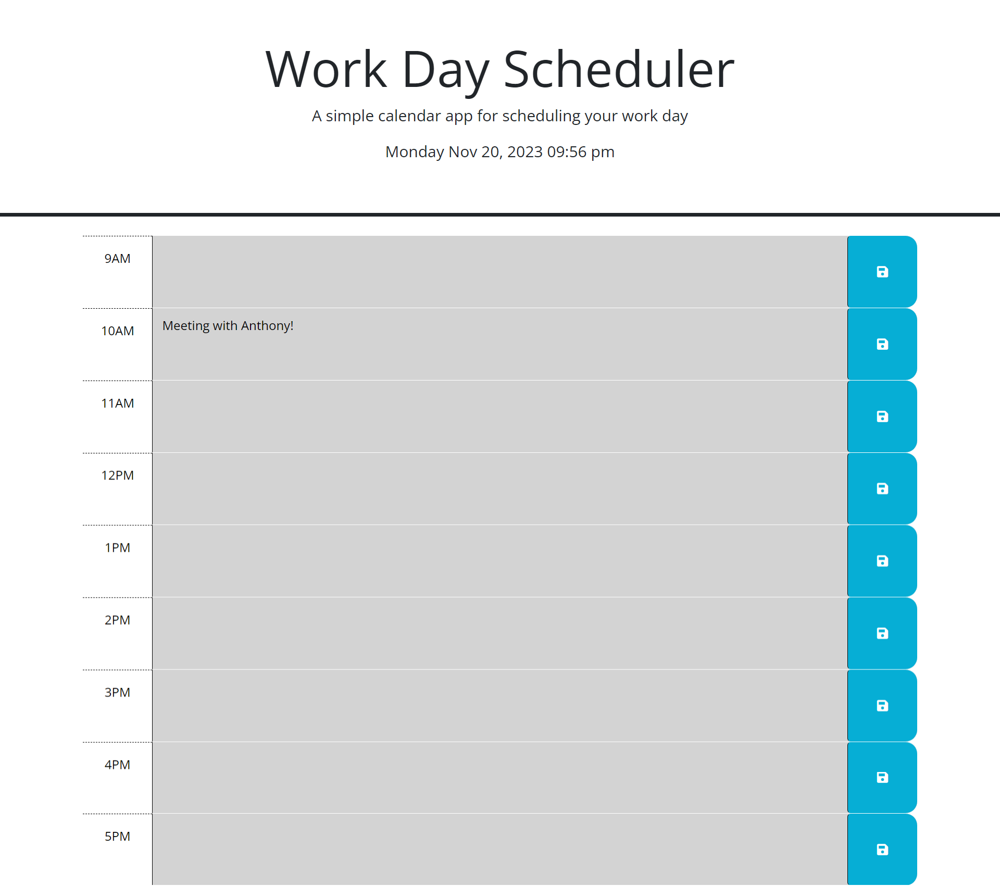

# work-scheduler

## Description
This was a simple work-day scheduler using JQuery, CSS, and HTML. It allows users to save events for each hour in a typical 9-5 workday. It also changes color based on past, present, and future times. 

## ScreenShot

# Link to Deployed Site
https://dawnie2021.github.io/work-scheduler/
